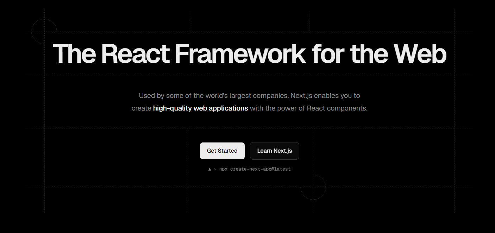

# Introduction to Full Stack Frameworks

## Introduction to Full Stack Frameworks

### What are Full Stack Frameworks?

Full stack frameworks are comprehensive solutions that enable developers to build complete web applications with both frontend and backend functionality using a unified technology stack. Unlike traditional setups where frontend (React, Vue) and backend (Express, Django) are separate, full stack frameworks provide integrated tools for handling:

- **Frontend UI rendering** - Building interactive user interfaces
- **Backend logic** - Processing business logic and data manipulation
- **Database operations** - Direct database integration and ORM support
- **API management** - Creating and managing APIs seamlessly
- **Deployment** - Optimized deployment and hosting strategies

**Key Benefits:**
- Reduced context switching between frontend and backend code
- Shared code and type safety across the stack
- Simplified development workflow
- Built-in performance optimizations
- Consistent developer experience

### State of Frameworks in 2026

The full stack framework landscape has matured significantly:

**Modern Full Stack Frameworks:**
- **Next.js** - The dominant framework for React-based full stack development
- **Remix** - Alternative React framework with focus on web standards
- **Svelte/SvelteKit** - Compiler-based approach with modern DX
- **Solid Start** - Emerging framework with fine-grained reactivity
- **Nuxt** - Vue-based full stack framework
- **Astro** - Content-focused with island architecture

**Trends:**
- Server-first architecture gaining traction
- Edge computing and serverless deployment
- API routes being replaced by more powerful alternatives
- Enhanced TypeScript support
- Improved database integration patterns
- Focus on Web Standards compliance

---

## Next.js Basics

### Why Next.js is So Popular

Next.js has become the go-to framework for React developers building full stack applications. Here's why:

1. **Zero-Config Setup** - Sensible defaults out of the box, minimal configuration needed
2. **Performance Optimized** - Automatic code splitting, image optimization, and lazy loading
3. **Developer Experience** - Hot module replacement, fast refresh, excellent error messages
4. **Flexibility** - Supports multiple rendering strategies (SSG, SSR, ISR, CSR)
5. **Full Stack Capability** - Backend API routes built into the framework
6. **Deployment** - Seamless deployment to Vercel with optimizations
7. **Community & Ecosystem** - Large community with extensive third-party integrations
8. **Industry Adoption** - Used by major companies and startups alike

### Next.js vs React.js

| Aspect | React.js | Next.js |
|--------|----------|---------|
| **Type** | Frontend library | Full stack framework |
| **Routing** | Requires React Router (third-party) | Built-in file-based routing |
| **Backend** | Requires separate backend server | Built-in API routes |
| **SSR** | Requires manual setup or Remix | Native support |
| **Build Setup** | Requires Webpack/Vite setup | Zero-config |
| **Performance** | Manual optimization needed | Automatic optimization |
| **Database** | No built-in integration | Easy integration with API routes |
| **Deployment** | Can deploy anywhere | Optimized for Vercel, works anywhere |
| **Learning Curve** | Moderate | Slightly steeper but worth it |

**When to use React alone:**
- Building embedded UI components
- Browser-only applications
- When you need maximum flexibility
- Simple prototypes or dashboards

**When to use Next.js:**
- Full stack applications
- SEO-important content
- When you need backend functionality
- Production applications requiring optimization

### Setting Up a Next.js Project

**Method 1: Using create-next-app (Recommended)**
```bash
npx create-next-app@latest my-app
# or with TypeScript
npx create-next-app@latest my-app --typescript
```

**Method 2: Manual Setup**
```bash
mkdir my-app
cd my-app
npm init -y
npm install next react react-dom
```

Then add to `package.json`:
```json
{
  "scripts": {
    "dev": "next dev",
    "build": "next build",
    "start": "next start",
    "lint": "next lint"
  }
}
```

**Project Structure:**
```
my-app/
├── app/                  # App router (React 18+)
│   ├── layout.tsx
│   ├── page.tsx
│   ├── (routes)/
│   └── api/              # API routes
├── pages/                # Pages router (legacy)
├── public/               # Static files
├── styles/               # CSS files
├── lib/                  # Utility functions
├── components/           # Reusable components
├── prisma/               # Database schema
├── next.config.js        # Next.js configuration
└── package.json
```

### File-Based Routing

Next.js uses a file-based routing system where your file structure automatically becomes your routes.

**App Router (Modern - React 18+):**

```
app/
├── page.tsx              → /
├── about/
│   └── page.tsx          → /about
├── blog/
│   ├── page.tsx          → /blog
│   └── [id]/
│       └── page.tsx      → /blog/123
├── dashboard/
│   ├── layout.tsx        → Shared layout
│   └── page.tsx          → /dashboard
└── api/
    └── users/
        └── route.ts      → /api/users
```

**Dynamic Routes:**
```
blog/[id]/page.tsx

// Accessed as:
/blog/1
/blog/hello-world
/blog/another-post
```

**Catch-all Routes:**
```
app/docs/[...slug]/page.tsx

// Matches:
/docs/guide
/docs/guide/getting-started
/docs/guide/getting-started/installation
```

**Optional Catch-all Routes:**
```
app/docs/[[...slug]]/page.tsx

// Matches:
/docs
/docs/guide
/docs/guide/getting-started
```

### Layouts in Next.js

Layouts allow you to define UI that is shared across multiple pages without unmounting.

**Basic Layout:**
```typescript
// app/layout.tsx
export default function RootLayout({
  children,
}: {
  children: React.ReactNode
}) {
  return (
    <html lang="en">
      <body>
        <header>
          <nav>Navigation Bar</nav>
        </header>
        {children}
        <footer>Footer Content</footer>
      </body>
    </html>
  )
}
```

**Nested Layouts:**
```
app/
├── layout.tsx                  # Root layout
├── page.tsx                    # Home page
└── dashboard/
    ├── layout.tsx              # Dashboard layout
    ├── page.tsx                # /dashboard
    ├── profile/
    │   └── page.tsx            # /dashboard/profile
    └── settings/
        └── page.tsx            # /dashboard/settings
```

```typescript
// app/dashboard/layout.tsx
export default function DashboardLayout({
  children,
}: {
  children: React.ReactNode
}) {
  return (
    <div className="dashboard">
      <aside className="sidebar">
        <nav>
          <a href="/dashboard">Home</a>
          <a href="/dashboard/profile">Profile</a>
          <a href="/dashboard/settings">Settings</a>
        </nav>
      </aside>
      <main>{children}</main>
    </div>
  )
}
```

---

## SSG, SSR, ISR

Next.js provides multiple rendering strategies to optimize performance and SEO. Choose the right one for your use case.

### Server-Side Rendering (SSR)

**What it is:** HTML is generated on the server for each request, sent to the client.

**How it works:**
1. User requests a page
2. Server generates HTML on-demand
3. HTML is sent to browser
4. Browser displays page (hydration)

**When to use:**
- Dynamic data that changes frequently
- User-specific content
- Real-time data
- When you need fresh data for every request

**Implementation:**
```typescript
// app/products/[id]/page.tsx
export default async function ProductPage({ 
  params 
}: { 
  params: { id: string } 
}) {
  // This runs on server for every request
  const res = await fetch(`https://api.example.com/products/${params.id}`, {
    cache: 'no-store' // Don't cache, fetch fresh data
  });
  const product = await res.json();

  return <div>{product.name}</div>
}
```

**Pros:**
- Always fresh data
- Secure (API keys stay on server)
- Great for personalized content

**Cons:**
- Slower initial response
- Higher server load
- Not ideal for high-traffic sites

### Static Site Generation (SSG)

**What it is:** HTML is generated at build time and reused for all requests.

**How it works:**
1. Build time: Server generates all static HTML files
2. Files stored on CDN
3. User requests page
4. Pre-generated HTML served instantly

**When to use:**
- Content that changes infrequently
- Blog posts, documentation
- Marketing pages
- Maximum performance needed

**Implementation:**
```typescript
// app/blog/[slug]/page.tsx
export async function generateStaticParams() {
  // Get all blog slugs at build time
  const posts = await fetch('https://api.example.com/posts').then(r => r.json());
  
  return posts.map(post => ({
    slug: post.slug
  }))
}

export default async function BlogPost({ 
  params 
}: { 
  params: { slug: string } 
}) {
  // Data fetched at build time
  const res = await fetch(`https://api.example.com/posts/${params.slug}`, {
    cache: 'force-cache' // Cache forever
  });
  const post = await res.json();

  return <article>{post.content}</article>
}
```

**Pros:**
- Ultra-fast delivery
- Low server cost
- Works on any CDN
- Best for SEO

**Cons:**
- Rebuild needed for content updates
- Not suitable for dynamic data
- Build time increases with more pages

### Incremental Static Regeneration (ISR)

**What it is:** Combines SSG speed with SSR freshness. Static pages are regenerated in the background on-demand.

**How it works:**
1. Page is statically generated at build time
2. User requests page → serve cached HTML
3. If cache is stale, trigger background regeneration
4. Next request gets fresh version

**When to use:**
- Content that updates occasionally
- Large number of pages (too many to generate at build)
- Need performance but with fresh data
- Blog posts with occasional updates

**Implementation:**
```typescript
// app/products/[id]/page.tsx
export const revalidate = 3600; // Regenerate every hour

export async function generateStaticParams() {
  const products = await fetch('https://api.example.com/products').then(r => r.json());
  
  return products.slice(0, 100).map(product => ({
    id: product.id
  }))
}

export default async function ProductPage({ 
  params 
}: { 
  params: { id: string } 
}) {
  const res = await fetch(`https://api.example.com/products/${params.id}`, {
    next: { revalidate: 3600 } // Revalidate every hour
  });
  const product = await res.json();

  return <div>{product.name}</div>
}
```

**On-Demand Revalidation:**
```typescript
// app/api/revalidate/route.ts
import { revalidatePath } from 'next/cache';

export async function POST() {
  // Revalidate specific paths when triggered
  revalidatePath('/blog');
  revalidatePath('/products');
  
  return { revalidated: true, now: Date.now() }
}
```

**Pros:**
- Fast initial load with fresh data
- Handles high traffic well
- Works for large page counts
- Can revalidate on-demand

**Cons:**
- Slightly more complex setup
- Stale content briefly shown
- Requires understanding cache behavior

### Comparison Table

| Aspect | SSG | SSR | ISR |
|--------|-----|-----|-----|
| **Generation** | Build time | Request time | Build + Background |
| **Speed** | Ultra fast | Moderate | Very fast |
| **Freshness** | Static until rebuild | Always fresh | Fresh within interval |
| **CDN** | Excellent | Limited | Excellent |
| **Use Case** | Static content | Dynamic content | Hybrid |
| **Build Time** | Scales with pages | N/A | Minimal |
| **Server Load** | Low | High | Low |

---

## Building APIs in Next.js

### API Routes

API routes are serverless functions that handle HTTP requests. They're created in the `app/api` directory.

**Basic API Route:**
```typescript
// app/api/hello/route.ts
export async function GET(request: Request) {
  return Response.json({ message: 'Hello, world!' })
}
```

**With Dynamic Parameters:**
```typescript
// app/api/users/[id]/route.ts
export async function GET(
  request: Request,
  { params }: { params: { id: string } }
) {
  const userId = params.id;
  return Response.json({ userId })
}
```

### HTTP Methods: GET, POST, PUT, PATCH, DELETE

**GET - Fetch Data:**
```typescript
export async function GET(request: Request) {
  // Query parameters: /api/users?page=1&limit=10
  const { searchParams } = new URL(request.url);
  const page = searchParams.get('page');
  const limit = searchParams.get('limit');

  return Response.json({ 
    users: [],
    page,
    limit
  })
}
```

**POST - Create Data:**
```typescript
export async function POST(request: Request) {
  const body = await request.json();
  
  // Validate input
  if (!body.name || !body.email) {
    return Response.json(
      { error: 'Name and email required' },
      { status: 400 }
    )
  }

  // Create user in database
  const user = await db.user.create({
    data: { name: body.name, email: body.email }
  });

  return Response.json(user, { status: 201 })
}
```

**PUT - Replace Data:**
```typescript
export async function PUT(
  request: Request,
  { params }: { params: { id: string } }
) {
  const body = await request.json();
  const userId = params.id;

  // Update entire resource
  const user = await db.user.update({
    where: { id: userId },
    data: body
  });

  return Response.json(user)
}
```

**PATCH - Partial Update:**
```typescript
export async function PATCH(
  request: Request,
  { params }: { params: { id: string } }
) {
  const body = await request.json();
  const userId = params.id;

  // Update only provided fields
  const user = await db.user.update({
    where: { id: userId },
    data: {
      ...body // Only update what's provided
    }
  });

  return Response.json(user)
}
```

**DELETE - Remove Data:**
```typescript
export async function DELETE(
  request: Request,
  { params }: { params: { id: string } }
) {
  const userId = params.id;

  // Delete from database
  const user = await db.user.delete({
    where: { id: userId }
  });

  return Response.json({ 
    message: 'User deleted',
    user 
  })
}
```

### Connecting with Database

**Using Prisma (Recommended ORM):**

```typescript
// lib/db.ts
import { PrismaClient } from '@prisma/client';

const globalForPrisma = global as unknown as { prisma: PrismaClient };

export const prisma =
  globalForPrisma.prisma ||
  new PrismaClient();

if (process.env.NODE_ENV !== 'production') {
  globalForPrisma.prisma = prisma;
}
```

```typescript
// app/api/users/route.ts
import { prisma } from '@/lib/db';

export async function GET() {
  try {
    const users = await prisma.user.findMany();
    return Response.json(users);
  } catch (error) {
    return Response.json(
      { error: 'Failed to fetch users' },
      { status: 500 }
    );
  }
}

export async function POST(request: Request) {
  try {
    const body = await request.json();
    
    const user = await prisma.user.create({
      data: body
    });
    
    return Response.json(user, { status: 201 });
  } catch (error) {
    return Response.json(
      { error: 'Failed to create user' },
      { status: 500 }
    );
  }
}
```

### Structured Responses and Error Handling

**Standard Response Format:**
```typescript
// lib/response.ts
export function success<T>(data: T, status = 200) {
  return Response.json(
    { success: true, data },
    { status }
  );
}

export function error(message: string, status = 400) {
  return Response.json(
    { success: false, error: message },
    { status }
  );
}
```

**Using Response Helpers:**
```typescript
// app/api/users/[id]/route.ts
import { success, error } from '@/lib/response';
import { prisma } from '@/lib/db';

export async function GET(
  request: Request,
  { params }: { params: { id: string } }
) {
  try {
    const user = await prisma.user.findUnique({
      where: { id: params.id }
    });

    if (!user) {
      return error('User not found', 404);
    }

    return success(user);
  } catch (err) {
    return error('Internal server error', 500);
  }
}

export async function PUT(
  request: Request,
  { params }: { params: { id: string } }
) {
  try {
    const body = await request.json();

    // Validation
    if (!body.name && !body.email) {
      return error('At least one field required', 400);
    }

    const user = await prisma.user.update({
      where: { id: params.id },
      data: body
    });

    return success(user);
  } catch (err) {
    return error('Failed to update user', 500);
  }
}
```

**Comprehensive Error Handling:**
```typescript
export async function POST(request: Request) {
  try {
    const body = await request.json();

    // Validate required fields
    const { name, email, password } = body;
    if (!name || !email || !password) {
      return error('Missing required fields', 400);
    }

    // Validate email format
    if (!email.includes('@')) {
      return error('Invalid email format', 400);
    }

    // Check if user exists
    const existingUser = await prisma.user.findUnique({
      where: { email }
    });

    if (existingUser) {
      return error('Email already registered', 409);
    }

    // Hash password and create user
    const hashedPassword = await hashPassword(password);
    const user = await prisma.user.create({
      data: {
        name,
        email,
        password: hashedPassword
      }
    });

    return success(user, 201);
  } catch (err) {
    console.error('Signup error:', err);
    return error('Internal server error', 500);
  }
}
```

---

## Server Actions

Server Actions are an advanced feature that allows you to call server-side functions directly from client components, eliminating the need for manual API route creation.

### Server Actions vs API Routes

| Aspect | API Routes | Server Actions |
|--------|-----------|-----------------|
| **Definition** | Explicit endpoints | Direct function calls |
| **Setup** | Manual route creation | Async functions marked with 'use server' |
| **Call Method** | HTTP fetch | Direct function import |
| **Response Type** | JSON via HTTP | Direct return values |
| **Learning Curve** | Familiar | Slightly different mental model |
| **Use Case** | Traditional APIs | Form submissions, mutations |
| **Error Handling** | Standard HTTP | Exception throwing |
| **Security** | Standard CORS | Built-in server safety |

**When to use Server Actions:**
- Form submissions
- Data mutations
- Direct function-like calls
- Simplified backend logic

**When to use API Routes:**
- Third-party integrations
- Webhook handlers
- Complex middleware
- When you need HTTP semantics

### 'use server' Directive

The `'use server'` directive marks a function to run on the server, even when imported into client components.

**File-level Declaration:**
```typescript
// app/actions/user.ts
'use server';

import { prisma } from '@/lib/db';

export async function createUser(formData: FormData) {
  const name = formData.get('name');
  const email = formData.get('email');

  const user = await prisma.user.create({
    data: { name, email }
  });

  return user;
}
```

**Function-level Declaration:**
```typescript
// app/components/CreateUserForm.tsx
import { ReactNode } from 'react';

async function handleSubmit(formData: FormData) {
  'use server';
  
  const name = formData.get('name');
  // Server-side logic
  console.log('Processing on server:', name);
}

export function CreateUserForm() {
  return (
    <form action={handleSubmit}>
      <input name="name" required />
      <button type="submit">Create</button>
    </form>
  );
}
```

### Implementing Server Actions

**Basic Example:**
```typescript
// app/actions/users.ts
'use server';

import { prisma } from '@/lib/db';
import { revalidatePath } from 'next/cache';

export async function addUser(formData: FormData) {
  const name = formData.get('name') as string;
  const email = formData.get('email') as string;

  try {
    const user = await prisma.user.create({
      data: { name, email }
    });

    revalidatePath('/users');
    return { success: true, user };
  } catch (error) {
    return { success: false, error: 'Failed to create user' };
  }
}
```

**Using in a Client Component:**
```typescript
// app/components/UserForm.tsx
'use client';

import { addUser } from '@/app/actions/users';
import { useState } from 'react';

export function UserForm() {
  const [loading, setLoading] = useState(false);
  const [error, setError] = useState('');

  async function handleSubmit(e: React.FormEvent<HTMLFormElement>) {
    e.preventDefault();
    setLoading(true);
    setError('');

    const formData = new FormData(e.currentTarget);
    const result = await addUser(formData);

    if (!result.success) {
      setError(result.error);
    }

    setLoading(false);
  }

  return (
    <form onSubmit={handleSubmit}>
      <input name="name" required placeholder="Name" />
      <input name="email" required placeholder="Email" />
      <button type="submit" disabled={loading}>
        {loading ? 'Creating...' : 'Create User'}
      </button>
      {error && <p style={{ color: 'red' }}>{error}</p>}
    </form>
  );
}
```

**Advanced Example with Validation:**
```typescript
// app/actions/posts.ts
'use server';

import { prisma } from '@/lib/db';
import { revalidatePath } from 'next/cache';

export async function updatePost(id: string, formData: FormData) {
  const title = formData.get('title') as string;
  const content = formData.get('content') as string;

  // Validation
  if (!title || title.length < 3) {
    return { 
      success: false, 
      error: 'Title must be at least 3 characters' 
    };
  }

  if (!content || content.length < 10) {
    return { 
      success: false, 
      error: 'Content must be at least 10 characters' 
    };
  }

  try {
    const post = await prisma.post.update({
      where: { id },
      data: { title, content, updatedAt: new Date() }
    });

    revalidatePath(`/posts/${id}`);
    revalidatePath('/posts');

    return { success: true, post };
  } catch (error) {
    return { 
      success: false, 
      error: 'Failed to update post' 
    };
  }
}

export async function deletePost(id: string) {
  try {
    await prisma.post.delete({
      where: { id }
    });

    revalidatePath('/posts');
    return { success: true };
  } catch (error) {
    return { 
      success: false, 
      error: 'Failed to delete post' 
    };
  }
}
```

**Using Multiple Server Actions:**
```typescript
// app/components/PostEditor.tsx
'use client';

import { updatePost, deletePost } from '@/app/actions/posts';
import { useState } from 'react';

export function PostEditor({ post }: { post: any }) {
  const [editing, setEditing] = useState(false);

  async function handleUpdate(formData: FormData) {
    const result = await updatePost(post.id, formData);
    if (result.success) {
      setEditing(false);
    }
  }

  async function handleDelete() {
    if (confirm('Delete post?')) {
      await deletePost(post.id);
    }
  }

  return (
    <div>
      {editing ? (
        <form action={handleUpdate}>
          <input name="title" defaultValue={post.title} />
          <textarea name="content" defaultValue={post.content} />
          <button type="submit">Save</button>
          <button type="button" onClick={() => setEditing(false)}>
            Cancel
          </button>
        </form>
      ) : (
        <>
          <h2>{post.title}</h2>
          <p>{post.content}</p>
          <button onClick={() => setEditing(true)}>Edit</button>
          <button onClick={handleDelete}>Delete</button>
        </>
      )}
    </div>
  );
}
```

### Best Practices for Server Actions

1. **Always validate input** - Don't trust client-side validation
2. **Handle errors gracefully** - Return structured error responses
3. **Use revalidatePath** - Keep cached data fresh after mutations
4. **Protect sensitive operations** - Verify user authentication/authorization
5. **Log important actions** - For debugging and auditing
6. **Type your data** - Use TypeScript for type safety
7. **Cache static data** - Use `cache: 'force-cache'` for stable data
8. **Keep functions focused** - Single responsibility principle

---

## Summary

Full stack frameworks like Next.js provide powerful abstractions that:
- Simplify development by unifying frontend and backend
- Optimize performance with multiple rendering strategies
- Provide excellent developer experience out of the box
- Handle deployment complexities automatically

Understanding when and how to use SSG, SSR, ISR, API routes, and Server Actions is key to building efficient, scalable applications in 2026.
